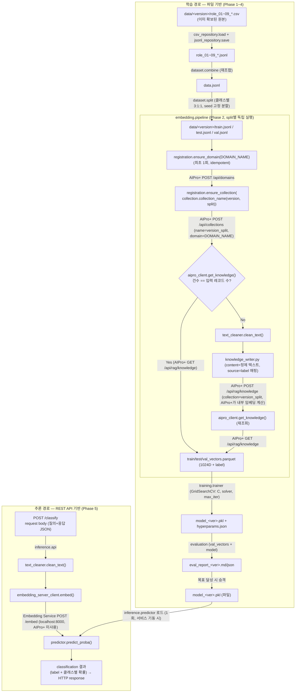

# Application / System Architecture Design

[[Scope_Definition]]의 5-Phase 파이프라인(데이터 준비 → 임베딩 변환 → 모델 학습 → 검증 →
추론)을 실제 코드 구조로 구체화한 설계서. [[CLAUDE.md]]의 SOLID, workflow 친화, Docker
원칙을 반영한다.

## 1. 아키텍처 개요

배치 파이프라인(Phase 1~4)과 상시 구동 추론 서비스(Phase 5)를 분리한다. 각 Phase는
독립 CLI 진입점으로, 파일(디스크) 입출력을 통해서만 연동한다 — 함수 직접 호출로 체이닝
하지 않는다. 이는 향후 워크플로우 도구(Airflow류) 이식과, 실패한 Phase만 재실행하는
것을 가능하게 한다.

```
[Phase 1] 데이터 준비(포맷 변환)   data/<version>/role_01~09_*.csv(이미 확보된 원본) → role_01~09_*.jsonl
[Phase 1.5] 데이터 조합/분할       role_*.jsonl → data.jsonl → train/test/val.jsonl
[Phase 2] 임베딩 변환              train/test/val.jsonl → *_vectors.parquet (AIPro+ 등록+조회, 독립 Embedding Service 미사용)
[Phase 3] 모델 학습                *_vectors.parquet → model_<ver>.pkl (GridSearchCV)
[Phase 4] 검증                     val_vectors.parquet + model.pkl → eval_report.md/json
[Phase 5] 추론 서비스              FastAPI 상시 서비스, model_<ver>.pkl 로드 후 실시간 분류
```

Phase 1은 **새 데이터를 만드는 단계가 아니다** — 질의·응답 내용 자체는 이미 확보되어
있고(현재는 CSV, [[P1_설계서_DataPreparation]] 1절), Phase 1의 코드는 그 원본을 학습
파이프라인이 쓰는 JSONL로 변환하는 일만 한다. 각 화살표는 "파일 경로"이며, 다음 Phase의
CLI는 이 경로를 `--input` 인자로 받는다. 상류 원본(`role_*.jsonl`)을 하류 결과가 절대
덮어쓰지 않는다([[P1_Data_Preprocessing_Review]] 사고 재발 방지 — role → data →
train/test/val 순서만 허용).

## 2. 모듈 구조 (SOLID — SRP/DIP 중심)

```
src/embedding_lr/
├── config.py              # .env 로딩 (pydantic-settings)
├── constants.py           # 고정 도메인 상수: 5개 클래스 라벨, 데이터 split 종류(train/test/validation), 임베딩 차원(1024)
├── domain/
│   ├── models.py          # QueryRecord, KnowledgeRecord, KnowledgeItem, PredictionResult (dataclass/pydantic)
│   └── interfaces.py      # Protocol: EmbeddingClient(독립 Embedding Service, Phase 5 전용), VectorStore(AIPro+, Phase 2 전용), Classifier, DataRepository
├── preprocessing/
│   └── text_cleaner.py    # 코드펜스 구분자 제거 + 스택 트레이스 라인 제거 + 공백 정규화 (P2_설계서_TextCleaning 참고) — Phase2와 추론에서 공유
├── data_generation/       # Phase 1 — 이미 확보된 원본(현재 CSV)을 JSONL로 변환
│   ├── csv_repository.py    # `DataRepository` 구현체 — 레거시 CSV 읽기 전용(save는 미지원, CSV로는 내보내지 않음)
│   └── jsonl_repository.py  # `DataRepository` 구현체(JSONL) — 지금은 이 형식뿐이지만 형식이 바뀌면 이 구현체만 교체(P1_설계서_DataPreparation 참고)
├── dataset/                # Phase 1.5 — `list[QueryRecord]` 위에서만 동작, 파일 형식을 모른다(DIP)
│   ├── combine.py          # role 9개 `list[QueryRecord]` → 재조합, 클래스당 200건 검증
│   └── split.py            # `list[QueryRecord]` → 클래스별 3:1:1 stratified 분할 (seed 고정)
├── embedding/               # Phase 2(학습, AIPro+) + Phase 5 추론용 클라이언트(독립 Embedding Service)
│   ├── aipro_client.py      # VectorStore 구현체 — AIPro+ API(localhost:28000) HTTP 호출. get_knowledge()(GET /api/rag/knowledge, 임베딩 포함 조회). Phase 2 전용
│   ├── embedding_server_client.py  # EmbeddingClient 구현체 — AIPro+와 무관한 독립 Embedding Service(localhost:8000) HTTP 호출. embed()(POST /embed). Phase 5 추론 전용
│   ├── collection.py        # 순수 로직 — version+split(경로에서 자동 추출) → 콜렉션명 `<version>_<train|test|validation>` 생성 규칙 (외부 의존성 없음). AIPro+ collection_name 패턴(`^[a-zA-Z0-9_-]+$`, 점 불가)에 맞춰 version 문자열의 `.`을 `_`로 치환(예: v0.2 → v0_2)
│   ├── registration.py      # AIPro+ 사전 등록 보장(HTTP 호출) — ensure_domain(DOMAIN_NAME, 최초 1회) + ensure_collection(collection.collection_name(version, split)), 둘 다 이미 존재하면 무시(idempotent)
│   ├── knowledge_writer.py  # category(라벨)를 source 필드로 매핑해 AIPro+ POST /api/rag/knowledge 적재(content 기반, AIPro+가 내부에서 임베딩 계산) — 레코드 단위 중복 판별 없음, 콜렉션 전체 재등록
│   └── pipeline.py          # jsonl → registration.ensure_domain/ensure_collection → aipro_client.get_knowledge()로 콜렉션 기존 건수 확인 → 건수 일치 시 재등록 스킵, 불일치 시 text_cleaner → knowledge_writer(등록) → get_knowledge()(재조회) → parquet 저장. embed()는 호출하지 않음
├── training/                # Phase 3
│   ├── trainer.py           # Classifier 구현체 — sklearn LogisticRegression + GridSearchCV
│   └── persistence.py       # joblib save/load, 버전 관리(model_<ver>.pkl)
├── evaluation/               # Phase 4
│   ├── metrics.py            # accuracy/F1/confusion matrix, IT vs NON_IT 집계
│   └── report.py             # 테스트 결과서 생성 (md/json)
├── inference/
│   ├── predictor.py          # 모델 + EmbeddingClient(embedding_server_client) 조합, predict_proba
│   └── api.py                # FastAPI: POST /classify
└── cli/                      # 워크플로우 트리거 경계 — Phase별 독립 실행 진입점
    ├── run_phase1.py, run_phase1_5.py ... run_phase4.py
    └── run_inference_server.py
```

**DIP 적용 지점**: `embedding/pipeline.py`는 `VectorStore` Protocol(AIPro+)에, `inference/predictor.py`는
`EmbeddingClient` Protocol(독립 Embedding Service)에, `training/trainer.py`는 `Classifier`
Protocol에만 의존한다 — 서로 다른 두 외부 서비스(AIPro+/Embedding Service)를 각각
다른 Protocol로 분리했으므로(ISP), 한쪽 서비스를 교체해도 다른 경로는 영향받지 않는다.
LogisticRegression을 다른 분류기로 바꿔도 파이프라인 로직은 수정하지 않는다. 테스트에서는 이 Protocol을 가짜(fake) 구현으로 교체해 TDD를
수행한다. `dataset/combine.py`·`dataset/split.py`도 같은 원칙을 따른다 — 파일이 아니라
`DataRepository` Protocol이 반환한 `list[QueryRecord]` 위에서만 동작하므로, 원본 데이터의
형식이 지금은 CSV(`data_generation/csv_repository.py`, 읽기 전용)이고 저장은
JSONL(`data_generation/jsonl_repository.py`)로 하지만, 나중에 원본 형식이 또 바뀌어도
(예: 다른 포맷의 원본, Parquet, DB) 이 두 모듈과 CLI 오케스트레이션 로직은 수정하지
않고 `DataRepository` 구현체만 추가/교체하면 된다([[P1_설계서_DataPreparation]] 참고).

## 3. Workflow 친화 규약 (모든 Phase 공통)

각 `cli/run_phaseN.py`는 다음 계약을 지킨다.

| 항목 | 규약 |
|---|---|
| Trigger | `python -m embedding_lr.cli.run_phaseN --input <path> --output <path> [--config <path>]` |
| Input | 명시적 파일 경로 인자로만 받음(암묵적 상대경로 탐색 금지) |
| Output | 명시적 파일 경로 인자로만 씀. 지정 없으면 `<phase>_<timestamp>.ext`로 자동 버전링 — 기존 파일 덮어쓰기 없음 |
| 모니터링 | 시작/종료/실패를 `status/<phase>_<run_id>.json`에 기록 (started_at, ended_at, status, error) |
| 재시작 | 실패 시 해당 Phase만 동일 input으로 재실행 가능 — 이전 Phase 산출물은 그대로 보존됨 |

## 4. 데이터 흐름 상세

학습 경로(Phase 1~4)는 **파일**을 입출력으로 삼는 배치 흐름이고, 추론 경로(Phase 5)는
**REST API 요청 본문(request body)**을 입력으로, **분류 결과**를 출력으로 삼는 실시간
흐름이다. 두 경로는 `text_cleaner`(전처리)를 동일하게 공유하지만, 임베딩을 얻는 방식은
서로 다른 외부 서비스를 쓴다 — 학습 경로는 `aipro_client`(AIPro+, 지식 등록 후 일괄
조회)를, 추론 경로는 `embedding_server_client`(AIPro+와 무관한 독립 Embedding Service)를
쓴다([[Scope_Definition]] 2.1절). 학습 경로의 최종 산출물(`model_<ver>.pkl`)이 추론
경로로 넘어가는 유일한 접점이다.

Phase 2 진입 시 `registration.ensure_domain()`이 프로젝트 고정 도메인(`DOMAIN_NAME`
상수)이 AIPro+에 존재하는지 먼저 보장한다(최초 실행 시 1회 생성, 이후 실행은 존재
확인만 하고 통과 — idempotent). 그다음 입력 경로(`data/<version>/{train,test,val}.jsonl`)
에서 **`version`과 `split`(train/test/validation)을 자동 추출**해 `collection.py`의
순수 함수로 `<version>_<split>` 콜렉션명을 만들고, 이를 `registration.ensure_collection()`
이 AIPro+ `POST /api/collections`의 `collection_name`(시스템 내부 고유 ID)으로 등록한다
(`name`은 UI 표시용 별칭으로 별도 필드 — 예: 그대로 같은 문자열을 넣어도 무방). 도메인처럼
"하위"로 귀속되는 필드는 없고(`CollectionCreate`에 `domain_id`가 없음 — 실 API 확인,
2026-08-19), 도메인·콜렉션은 서로 독립적인 분류축이며 지식 데이터 등록 시
`domain_id`+`collection_name`을 함께 지정해 둘을 연결한다. `collection_name`은 AIPro+가
`^[a-zA-Z0-9_-]+$`만 허용(점 `.` 금지, 422로 검증)하므로 `collection.py`가 version
문자열의 `.`을 `_`로 치환한다(예: `v0.2` + `train` → `v0_2_train`). 이후 같은 버전·용도의
임베딩 upsert(`POST /api/rag/knowledge`)는 이 콜렉션에 귀속되어, 데이터 버전 또는
용도(train/test/validation)가 바뀌면 자동으로 별도 콜렉션으로 분리된다 — 하드코딩 없이
버전×용도와 콜렉션이 1:1로 매핑된다([[CLAUDE.md]] 4절). 도메인·콜렉션이 모두 사전
등록되어 있어야 `knowledge_writer.py`의 지식 데이터 적재가 성립한다 —
[[Scope_Definition]] 2.1절 "사전 등록 순서" 참고.

**의도(추적성)**: 항상 콜렉션 전체(train/test/validation 각각)를 한 번의 배치로 재적재하는
구조이므로, 레코드 단위 중복 판별(해시 비교 등)은 두지 않는다 — 재학습 시에는 해당
콜렉션을 전체 재등록(Upsert)한다. `knowledge_writer.py`가 `POST /api/rag/knowledge` 호출
시 `content`(정제된 텍스트)와 `source` 필드에 **분류 라벨값**(카테고리)을 실어 보내면
AIPro+가 내부에서 임베딩을 계산해 저장한다 — 이 프로젝트 코드는 임베딩을 직접 계산하지
않는다. `source`는 콜렉션 내에서도 라벨 단위로 데이터를 조회·추적할 수 있게 한다 —
[[Scope_Definition]] 8절 Golden Rule 3 "추적성 확보"와 동일한 목적.

**재실행 시 콜렉션 단위 재등록 스킵**: `ensure_collection()` 직후 `aipro_client.get_knowledge()`
(`GET /api/rag/knowledge`, `domain_id`+`collection`, `limit`=입력 split 레코드 수 이상)로
기존 등록 건수를 확인한다. 건수가 입력 JSONL 레코드 수와 일치하면 `text_cleaner`→
`knowledge_writer`(등록) 호출을 건너뛰고, 방금 조회한 결과의 `embedding`+`source`를 그대로
`*_vectors.parquet`으로 저장한다. 건수가 다르면(0건 포함) `text_cleaner`→`knowledge_writer`로
콜렉션 전체를 재등록한 뒤 다시 `get_knowledge()`로 조회해 parquet을 만든다 — 이 파이프라인은
어느 경로든 `embed()`를 호출하지 않는다(벡터는 항상 AIPro+가 계산·보관한 것을
`get_knowledge()`로 가져온다). 레코드 단위 비교는 하지 않으며, 판단 기준은 오직 콜렉션의
총 건수다([[Scope_Definition]] 2.1절 참고).



- **입력이 파일이 아님**: 추론 경로는 `train/test/val.jsonl` 같은 파일을 거치지 않고, HTTP
  요청 본문(질의+응답 JSON)을 바로 `text_cleaner`에 넣는다.
- **출력이 파일이 아님**: 추론 결과도 파일로 쓰지 않고, `predict_proba()` 결과를 즉시
  HTTP 응답(label, 클래스별 확률)으로 반환한다.
- `model_<ver>.pkl`은 서비스 기동 시 1회 로드되며, 요청마다 다시 읽지 않는다(추론 경로의
  유일한 "파일" 접점).

## 5. 기술 스택 및 라이브러리

| 영역 | 선택 | 이유 |
|---|---|---|
| 언어 | Python 3.11+ | 기존 스코프(scikit-learn, AIPro+ API 클라이언트)와 정합 |
| 데이터 처리 | pandas | JSONL(`read_json(lines=True)`)/표 형태 데이터, 클래스별 stratified split에 용이 |
| 임베딩 벡터 저장 | pyarrow / parquet | 1024D float 배열을 JSONL보다 효율적으로 저장·로드 |
| 분류 모델 | scikit-learn (`LogisticRegression`, `GridSearchCV`, `train_test_split`, `accuracy_score`, `f1_score`, `confusion_matrix`) | Scope Definition에서 이미 확정된 선택 |
| 모델 직렬화 | joblib | sklearn 모델 저장 표준 |
| HTTP 클라이언트 | httpx | AIPro+ API 호출(`POST`/`GET /api/rag/knowledge`, `localhost:28000`, Phase 2 전용) + 독립 Embedding Service 호출(`POST /embed`, `localhost:8000`, Phase 5 전용), 타임아웃/재시도 설정 용이, 추론 서비스에서 async 재사용 가능 |
| 설정 관리 | pydantic-settings (+ `.env`) | 타입 안전한 환경변수 로딩, [[CLAUDE.md]] "하드코딩 금지" 규칙 구현체 |
| 스키마/검증 | pydantic | FastAPI 요청/응답 모델, `domain/models.py`의 데이터 클래스 |
| 추론 API | FastAPI + uvicorn | Scope Definition의 "실시간 쿼리 분류 파이프라인" 요구사항 충족 |
| 테스트 | pytest + unittest.mock, respx(HTTP 모킹) | TDD, AIPro+ 의존성 없는 단위 테스트 |
| 로깅 | 표준 logging (JSON 포맷) | Workflow 모니터링용 구조화 로그 |
| 컨테이너 | Docker, docker-compose | [[CLAUDE.md]] 6절 |

### 선택적(필요 시 도입)

| 후보 | 용도 | 도입 시점 |
|---|---|---|
| 커스텀 데이터 검증 함수(pandera 등) | Phase 1.5 조합 직후 JSONL 스키마/라벨 값 검증 — [[P1_Data_Preprocessing_Review]]의 이스케이프 오류 같은 사고를 자동 감지 | Phase 1.5 구현 시 |
| mlflow (로컬 파일 백엔드) | 하이퍼파라미터 탐색 결과 실험 추적 | 재학습 반복이 많아질 때만, 과설계 방지를 위해 초기엔 `hyperparams.json` 기록으로 충분 |

## 6. Docker 구성

```
docker/
├── Dockerfile.pipeline     # Phase 1~4 배치 작업 공용 이미지 (pandas/sklearn/httpx/pydantic)
└── Dockerfile.inference    # Phase 5 상시 서비스 이미지 (+ fastapi/uvicorn)
```

- `Dockerfile.pipeline`: 단일 이미지, entrypoint는 `python -m embedding_lr.cli.run_phaseN`
  형태로 파라미터화. 배치 작업은 실행마다 컨테이너가 뜨고 끝나는 생명주기이므로, Phase별로
  이미지를 나누지 않고 실행 커맨드로만 구분한다.
- `Dockerfile.inference`: 상시 구동 서비스라는 별개의 생명주기이므로 별도 이미지로 분리.
- `docker-compose.yml`: `phase1`~`phase4`, `inference` 서비스 정의. 공통 `./data`, `./models`
  볼륨 마운트, `.env` 파일로 설정 주입.

## 7. 테스트 전략 (TDD 연계)

| 계층 | 대상 | 방식 |
|---|---|---|
| 단위 | `text_cleaner`, `collection`(콜렉션명 생성 규칙: `version_split`), `metrics` | 순수 함수, 외부 의존성 없음 |
| 단위(모킹) | `aipro_client`, `registration`, `knowledge_writer`, `predictor` | `EmbeddingClient`/`VectorStore` Protocol을 fake로 교체 또는 respx로 HTTP 모킹 |
| 통합 | `csv_repository`, `jsonl_repository`, `embedding.pipeline`, `training.trainer` | 소규모 fixture 데이터로 end-to-end 실행(파일 I/O는 `tmp_path`), 실제 AIPro+는 호출하지 않음 |
| E2E(수동/선택) | 전체 파이프라인 | 실제 AIPro+(`localhost:28000`) 대상, CI에는 포함하지 않음 |

## 8. 디렉터리 구조 요약

```
embedding-lr/
├── .env.example
├── docker-compose.yml
├── docker/
│   ├── Dockerfile.pipeline
│   └── Dockerfile.inference
├── src/embedding_lr/        # 2절 참고
├── tests/{unit,integration}/
├── data/                     # 기존 유지
├── models/                   # model_<ver>.pkl, hyperparams.json
├── status/                   # Phase 실행 로그(JSON)
├── prompt/                   # 기존 유지
└── docs/                     # 기존 유지
```
