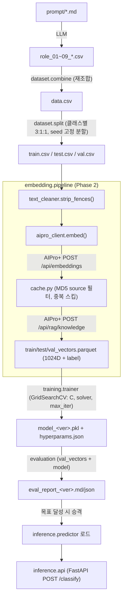

# Application / System Architecture Design

[[Scope_Definition]]의 5-Phase 파이프라인(데이터 생성 → 임베딩 변환 → 모델 학습 → 검증 →
추론)을 실제 코드 구조로 구체화한 설계서. [[CLAUDE.md]]의 SOLID, workflow 친화, Docker
원칙을 반영한다.

## 1. 아키텍처 개요

배치 파이프라인(Phase 1~4)과 상시 구동 추론 서비스(Phase 5)를 분리한다. 각 Phase는
독립 CLI 진입점으로, 파일(디스크) 입출력을 통해서만 연동한다 — 함수 직접 호출로 체이닝
하지 않는다. 이는 향후 워크플로우 도구(Airflow류) 이식과, 실패한 Phase만 재실행하는
것을 가능하게 한다.

```
[Phase 1] 데이터 생성        prompt/*.md → role_01~09_*.csv
[Phase 1.5] 데이터 조합/분할  role_*.csv → data.csv → train/test/val.csv
[Phase 2] 임베딩 변환        train/test/val.csv → *_vectors.parquet (AIPro+ API 호출)
[Phase 3] 모델 학습          *_vectors.parquet → model_<ver>.pkl (GridSearchCV)
[Phase 4] 검증               val_vectors.parquet + model.pkl → eval_report.md/json
[Phase 5] 추론 서비스        FastAPI 상시 서비스, model_<ver>.pkl 로드 후 실시간 분류
```

각 화살표는 "파일 경로"이며, 다음 Phase의 CLI는 이 경로를 `--input` 인자로 받는다.
상류 원본(`role_*.csv`)을 하류 결과가 절대 덮어쓰지 않는다([[P1_Data_Preprocessing_Review]]
사고 재발 방지 — role → data → train/test/val 순서만 허용).

## 2. 모듈 구조 (SOLID — SRP/DIP 중심)

```
src/embedding_lr/
├── config.py              # .env 로딩 (pydantic-settings)
├── constants.py           # 고정 도메인 상수: 5개 클래스 라벨, 해시 알고리즘(MD5), 임베딩 차원(1024)
├── domain/
│   ├── models.py          # QueryRecord, EmbeddingVector, PredictionResult (dataclass/pydantic)
│   └── interfaces.py      # Protocol: EmbeddingClient, VectorCache, Classifier, DataRepository
├── preprocessing/
│   └── text_cleaner.py    # 코드펜스(```) 제거 등 — Phase2와 추론에서 공유
├── data_generation/       # Phase 1
│   ├── prompt_loader.py
│   └── csv_writer.py
├── dataset/                # Phase 1.5
│   ├── combine.py          # role_*.csv → data.csv 재조합
│   └── split.py            # data.csv → train/test/val.csv (클래스별 3:1:1, seed 고정)
├── embedding/               # Phase 2
│   ├── aipro_client.py      # EmbeddingClient 구현체 — AIPro+ API(localhost:28000) HTTP 호출
│   ├── cache.py             # MD5 해시로 source 필터 조회 후 중복 임베딩 스킵
│   └── pipeline.py          # csv → text_cleaner → rag_client → cache → parquet 저장
├── training/                # Phase 3
│   ├── trainer.py           # Classifier 구현체 — sklearn LogisticRegression + GridSearchCV
│   └── persistence.py       # joblib save/load, 버전 관리(model_<ver>.pkl)
├── evaluation/               # Phase 4
│   ├── metrics.py            # accuracy/F1/confusion matrix, IT vs NON_IT 집계
│   └── report.py             # 테스트 결과서 생성 (md/json)
├── inference/
│   ├── predictor.py          # 모델+임베딩 클라이언트 조합, predict_proba
│   └── api.py                # FastAPI: POST /classify
└── cli/                      # 워크플로우 트리거 경계 — Phase별 독립 실행 진입점
    ├── run_phase1.py ... run_phase4.py
    └── run_inference_server.py
```

**DIP 적용 지점**: `embedding/pipeline.py`, `training/trainer.py`, `inference/predictor.py`는
`domain/interfaces.py`의 Protocol(`EmbeddingClient`, `Classifier`)에만 의존한다. AIPro+를
다른 임베딩 서비스로 교체하거나, LogisticRegression을 다른 분류기로 바꿔도 파이프라인
로직은 수정하지 않는다. 테스트에서는 이 Protocol을 가짜(fake) 구현으로 교체해 TDD를
수행한다.

## 3. Workflow 친화 규약 (모든 Phase 공통)

각 `cli/run_phaseN.py`는 다음 계약을 지킨다.

| 항목 | 규약 |
|---|---|
| Trigger | `python -m embedding_lr.cli.run_phaseN --input <path> --output <path> [--config <path>]` |
| Input | 명시적 파일 경로 인자로만 받음(암묵적 상대경로 탐색 금지) |
| Output | 명시적 파일 경로 인자로만 씀. 지정 없으면 `<phase>_<timestamp>.ext`로 자동 버전링 — 기존 파일 덮어쓰기 없음 |
| 모니터링 | 시작/종료/실패를 `status/<phase>_<run_id>.json`에 기록 (started_at, ended_at, status, error) |
| 재시작 | 실패 시 해당 Phase만 동일 input으로 재실행 가능 — 이전 Phase 산출물은 그대로 보존됨 |

## 4. 데이터 흐름 상세



## 5. 기술 스택 및 라이브러리

| 영역 | 선택 | 이유 |
|---|---|---|
| 언어 | Python 3.11+ | 기존 스코프(scikit-learn, AIPro+ API 클라이언트)와 정합 |
| 데이터 처리 | pandas | CSV/표 형태 데이터, 클래스별 stratified split에 용이 |
| 임베딩 벡터 저장 | pyarrow / parquet | 1024D float 배열을 CSV보다 효율적으로 저장·로드 |
| 분류 모델 | scikit-learn (`LogisticRegression`, `GridSearchCV`, `train_test_split`, `accuracy_score`, `f1_score`, `confusion_matrix`) | Scope Definition에서 이미 확정된 선택 |
| 모델 직렬화 | joblib | sklearn 모델 저장 표준 |
| HTTP 클라이언트 | httpx | AIPro+ API 호출(`/api/embeddings`, `/api/rag/knowledge`, `/api/rag/search`, `localhost:28000`), 타임아웃/재시도 설정 용이, 추론 서비스에서 async 재사용 가능 |
| 설정 관리 | pydantic-settings (+ `.env`) | 타입 안전한 환경변수 로딩, [[CLAUDE.md]] "하드코딩 금지" 규칙 구현체 |
| 스키마/검증 | pydantic | FastAPI 요청/응답 모델, `domain/models.py`의 데이터 클래스 |
| 추론 API | FastAPI + uvicorn | Scope Definition의 "실시간 쿼리 분류 파이프라인" 요구사항 충족 |
| 테스트 | pytest + unittest.mock, respx(HTTP 모킹) | TDD, AIPro+ 의존성 없는 단위 테스트 |
| 로깅 | 표준 logging (JSON 포맷) | Workflow 모니터링용 구조화 로그 |
| 컨테이너 | Docker, docker-compose | [[CLAUDE.md]] 6절 |

### 선택적(필요 시 도입)

| 후보 | 용도 | 도입 시점 |
|---|---|---|
| 커스텀 데이터 검증 함수(pandera 등) | Phase 1.5 조합 직후 CSV 스키마/라벨 값 검증 — [[P1_Data_Preprocessing_Review]]의 이스케이프 오류 같은 사고를 자동 감지 | Phase 1.5 구현 시 |
| mlflow (로컬 파일 백엔드) | 하이퍼파라미터 탐색 결과 실험 추적 | 재학습 반복이 많아질 때만, 과설계 방지를 위해 초기엔 `hyperparams.json` 기록으로 충분 |

## 6. Docker 구성

```
docker/
├── Dockerfile.pipeline     # Phase 1~4 배치 작업 공용 이미지 (pandas/sklearn/httpx/pydantic)
└── Dockerfile.inference    # Phase 5 상시 서비스 이미지 (+ fastapi/uvicorn)
```

- `Dockerfile.pipeline`: 단일 이미지, entrypoint는 `python -m embedding_lr.cli.run_phaseN`
  형태로 파라미터화. 배치 작업은 실행마다 컨테이너가 뜨고 끝나는 생명주기이므로, Phase별로
  이미지를 나누지 않고 실행 커맨드로만 구분한다.
- `Dockerfile.inference`: 상시 구동 서비스라는 별개의 생명주기이므로 별도 이미지로 분리.
- `docker-compose.yml`: `phase1`~`phase4`, `inference` 서비스 정의. 공통 `./data`, `./models`
  볼륨 마운트, `.env` 파일로 설정 주입.

## 7. 테스트 전략 (TDD 연계)

| 계층 | 대상 | 방식 |
|---|---|---|
| 단위 | `text_cleaner`, `cache`(해시 판별), `metrics` | 순수 함수, 외부 의존성 없음 |
| 단위(모킹) | `aipro_client`, `predictor` | `EmbeddingClient` Protocol을 fake로 교체 또는 respx로 HTTP 모킹 |
| 통합 | `embedding.pipeline`, `training.trainer` | 소규모 fixture 데이터로 end-to-end 실행, 실제 AIPro+는 호출하지 않음 |
| E2E(수동/선택) | 전체 파이프라인 | 실제 AIPro+(`localhost:28000`) 대상, CI에는 포함하지 않음 |

## 8. 디렉터리 구조 요약

```
embedding-lr/
├── .env.example
├── docker-compose.yml
├── docker/
│   ├── Dockerfile.pipeline
│   └── Dockerfile.inference
├── src/embedding_lr/        # 2절 참고
├── tests/{unit,integration}/
├── data/                     # 기존 유지
├── models/                   # model_<ver>.pkl, hyperparams.json
├── status/                   # Phase 실행 로그(JSON)
├── prompt/                   # 기존 유지
└── docs/                     # 기존 유지
```
